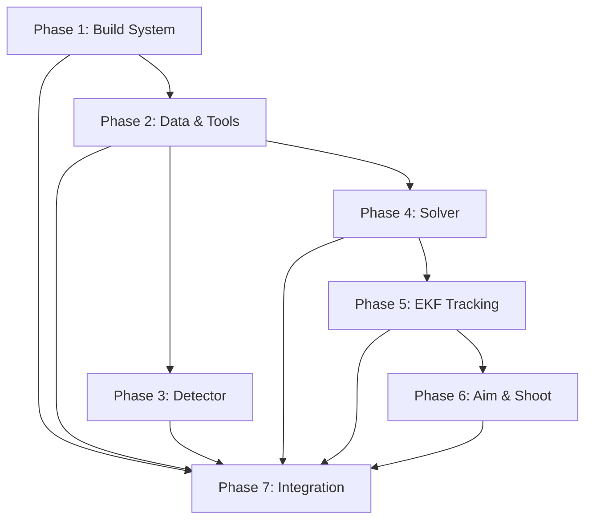

# Roadmap: 自瞄装甲板迁移

## Overview

**7 phases** | **All v1 requirements covered ✓**

| # | Phase | Goal |
|---|-------|------|
| 1 | 构建系统适配 | 添加依赖、创建 CMake、启用 app 子目录，确保可编译 |
| 2 | 数据结构与工具层 | 搬运 armor 数据结构、math_tools、img_tools |
| 3 | 灯条检测与装甲板匹配 | 搬运 detector 算法 |
| 4 | PnP 解算 | 搬运 solver 坐标变换和姿态解算 |
| 5 | EKF 目标跟踪 | 搬运 target、tracker、voter、EKF 实现 |
| 6 | 弹道预测与瞄准 | 搬运 trajectory、aimer、shooter |
| 7 | 集成测试 | 创建配置和测试程序，验证完整流水线 |

---

## Phase Details

### Phase 1: 构建系统适配

Goal: 在 Robocore 框架中新增 Eigen3 和 fmt 依赖，创建 `tools/CMakeLists.txt`，启用 `app/` 子目录，确保项目完整编译通过。

**Plans:** 2 plans

Success criteria:
1. Eigen3 安装并可在项目中 `#include <Eigen/Dense>`
2. `tools/` 有 CMakeLists.txt，编译为静态库
3. `app/` 子目录在顶层 CMake 中启用
4. 项目完整编译通过，无链接错误

Depends on: — (基础设施建设)

Plans:
- [ ] 01-01-PLAN.md — Install build toolchain and system dependencies (cmake, g++, Eigen3, Boost, OpenCV, Aravis, libusb)
- [ ] 01-02-PLAN.md — Create/update CMake configuration files, verify full build

### Phase 2: 数据结构与工具层

Goal: 搬运自瞄核心数据结构和数学工具。

**Plans:** 3 plans

Success criteria:
1. armor.hpp/.cpp 完整迁移（Lightbar、Armor、枚举）
2. math_tools.hpp/.cpp 完整迁移（limit_rad、eulers、xyz2ypd 等）
3. img_tools.hpp/.cpp 完整迁移（绘制函数）
4. 全部适配 Robocore 命名规范（namespace app::auto_aim、蛇形命名、include guard）
5. 项目完整编译通过，无链接错误

Depends on: Phase 1

Plans:
- [ ] 02-01-PLAN.md — 创建 app/auto_aim/armor.hpp/.cpp（数据结构迁移）
- [ ] 02-02-PLAN.md — 创建 tools/math_tools.hpp/.cpp 和 tools/img_tools.hpp/.cpp（工具函数迁移）
- [ ] 02-03-PLAN.md — 更新 CMakeLists.txt 并验证完整编译

### Phase 3: 灯条检测与装甲板匹配

Goal: 搬运 Detector 核心视觉算法。

**Plans:** 2 plans

Success criteria:
1. 完整的灯条提取流程（灰度化→二值化→轮廓→灯条校验）
2. 装甲板配对与几何校验
3. 共用灯条去重逻辑
4. Debug 可视化
5. OpenVINO 数字分类器迁移
6. YAML 到 TOML 配置文件格式迁移
7. YOLO ROI 精修重载
8. 项目完整编译通过

Depends on: Phase 2

Plans:
- [ ] 03-01-PLAN.md — Install OpenVINO + fmt, update CMake, create Classifier (TOML config, OpenVINO)
- [ ] 03-02-PLAN.md — Create Detector (TOML config, LOG_XXX logging, remove PCA corrector)

### Phase 4: PnP 解算

Goal: 搬运 Solver 坐标变换和姿态解算。

**Plans:** 1 plan

Success criteria:
1. 大/小装甲板 3D 模型点定义
2. solvePnP_IPPE 解算
3. 相机→云台→世界坐标变换链
4. yaw 优化（重投影误差搜索）

Depends on: Phase 2

Plans:
- [ ] 04-01-PLAN.md — Create solver.hpp/cpp with TOML config, PnP solve, coordinate transforms, yaw optimization

### Phase 5: EKF 目标跟踪

Goal: 搬运 Target EKF 跟踪 + Tracker 状态机 + Voter 投票。

**Plans:** {N} plans

Success criteria:
1. ExtendedKalmanFilter 实现（predict/update，自定义 h/z_subtract）
2. 11 维状态 EKF 初始化与预测
3. Tracker 状态机（lost→detecting→tracking→temp_lost）
4. 发散检测与收敛判断

Depends on: Phase 4

### Phase 6: 弹道预测与瞄准

Goal: 搬运 Aimer 瞄准点选择和弹道迭代 + Shooter 射击判定。

**Plans:** {N} plans

Success criteria:
1. Trajectory 弹道解算
2. 瞄准点选择（锁定模式/小陀螺模式）
3. 弹道迭代收敛（最多 10 次）
4. 射击条件判定

Depends on: Phase 5

### Phase 7: 集成测试

Goal: 创建配置文件和测试程序，验证完整自瞄流水线。

**Plans:** {N} plans

Success criteria:
1. `config/auto_aim.toml` 配置
2. `task/test/test_auto_aim.cpp` 测试程序
3. 所有模块正确链接，编译通过

Depends on: Phase 1~6

---

## Dependencies

