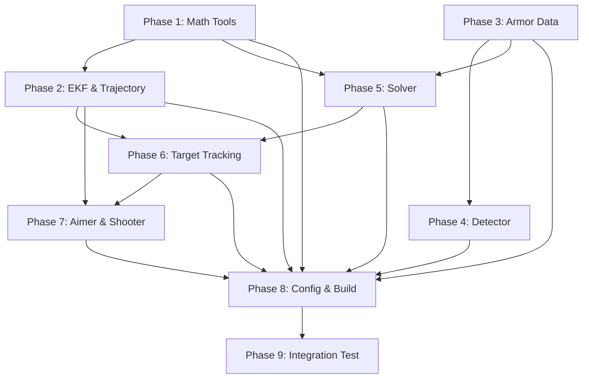

# Roadmap: 自瞄装甲板迁移

## Overview

**9 phases** | **39 requirements** | All v1 requirements covered ✓

| # | Phase | Goal | Reqs | Success Criteria |
|---|-------|------|------|-----------------|
| 1 | 数学工具工具库移植 | 迁移 math_tools 等数学工具 | MATH-01~07 | 所有数学函数正确编译并通过测试 |
| 2 | EKF 与弹道模型 | 迁移卡尔曼滤波和弹道解算 | EKF-01~03, TRAJ-01~02 | EKF 能正确预测更新，弹道可解算 pitch |
| 3 | 装甲板数据结构 | 迁移 Lightbar/Armor 数据结构和枚举 | DATA-01~04 | 数据结构完整，支持多种构造方式 |
| 4 | 灯条检测与装甲板匹配 | 迁移 Detector 核心算法 | DET-01~09, CLS-01~02 | 能正确从图像提取灯条并匹配装甲板 |
| 5 | PnP 解算 | 迁移 Solver 坐标变换和姿态解算 | SLV-01~05 | PnP 输出正确的 xyz/ypr 坐标 |
| 6 | 目标跟踪 | 迁移 Target + Tracker + Voter | TGT-01~05, TRK-01~05, VOT-01 | 能正确跟踪目标并处理丢失/重捕获 |
| 7 | 瞄准与射击 | 迁移 Aimer + Shooter | AIM-01~04, SHT-01~02 | 能正确计算瞄准点和判定射击时机 |
| 8 | 配置与构建 | 创建配置文件和构建系统 | CFG-01, BLD-01~02 | 项目可编译，配置可读取 |
| 9 | 集成测试 | 创建测试程序验证流水线 | TST-01 | 完整流水线测试通过 |

---

## Phase Details

### Phase 1: 数学工具工具库移植

Goal: 将 sp_vision_25 的 `tools/math_tools` 中所有数学函数迁移至 Robocore 的 `tools/` 目录。
Requirements: MATH-01, MATH-02, MATH-03, MATH-04, MATH-05, MATH-06, MATH-07
Success criteria:
1. `limit_rad()` 能正确将角度限制在 (-pi, pi]
2. `eulers()` 支持 ZYX 和 XYZ 顺序转换
3. `xyz2ypd()` / `ypd2xyz()` 互逆运算误差 < 1e-10
4. `delta_time()` 正确计算微秒级时间差
5. 所有函数在 C++20 下编译无警告
6. 遵循 Robocore 代码风格（蛇形命名、4空格、namespace tools）

Depends on: — (独立模块)

### Phase 2: EKF 与弹道模型

Goal: 迁移 ExtendedKalmanFilter 和 Trajectory 类。
Requirements: EKF-01, EKF-02, EKF-03, TRAJ-01, TRAJ-02
Success criteria:
1. EKF 支持自定义状态加法函数
2. EKF update 支持自定义观测函数 h
3. EKF 支持自定义 z_subtract（角度差处理）
4. NIS 卡方检验窗口正确记录失败率
5. Trajectory 能正确解算弹道 pitch 和飞行时间
6. 弹道模型在无解时正确标记 unsolvable

Depends on: Phase 1 (使用 MATH tools)

### Phase 3: 装甲板数据结构

Goal: 迁移 Lightbar、Armor 结构体和所有枚举类型。
Requirements: DATA-01, DATA-02, DATA-03, DATA-04
Success criteria:
1. Color/ArmorType/ArmorName/ArmorPriority 枚举完整
2. Lightbar 结构体包含所有关键字段（center, top, bottom, angle, length, ratio 等）
3. Lightbar 构造函数正确计算角度和长宽比
4. Armor 支持灯条对构造和神经网络构造
5. Armor 构造函数正确计算 ratio/side_ratio/rectangular_error
6. 遵循 Robocore 命名空间 app::auto_aim 规范

Depends on: — (独立数据结构)

### Phase 4: 灯条检测与装甲板匹配

Goal: 迁移 Detector 核心图像处理算法。
Requirements: DET-01, DET-02, DET-03, DET-04, DET-05, DET-06, DET-07, DET-08, DET-09, CLS-01, CLS-02
Success criteria:
1. 输入 BGR 图像正确完成灰度化和二值化
2. findContours 正确提取所有外轮廓
3. 灯条几何校验有效过滤非灯条区域
4. 颜色判定正确区分红蓝灯条
5. 灯条配对正确生成候选装甲板
6. 装甲板几何校验有效过滤无效配对
7. 共用灯条去重逻辑正确
8. Debug 可视化功能可用

Depends on: Phase 3 (使用 Armor/Lightbar 数据结构)

### Phase 5: PnP 解算

Goal: 迁移 Solver 坐标变换和姿态解算。
Requirements: SLV-01, SLV-02, SLV-03, SLV-04, SLV-05
Success criteria:
1. 大/小装甲板 3D 模型点尺寸正确
2. solvePnP_IPPE 正确解算 rvec/tvec
3. 相机→云台→世界坐标变换链正确
4. yaw 优化通过重投影误差搜索最小化
5. set_R_gimbal2world 正确更新云台姿态
6. ypr_in_gimbal/ypr_in_world/ypd_in_world 输出合理

Depends on: Phase 1 (使用 math_tools), Phase 3 (使用 Armor)

### Phase 6: 目标跟踪

Goal: 迁移 Target EKF 跟踪 + Tracker 状态机 + Voter 投票。
Requirements: TGT-01, TGT-02, TGT-03, TGT-04, TGT-05, TRK-01, TRK-02, TRK-03, TRK-04, TRK-05, VOT-01
Success criteria:
1. Target 11 维 EKF 初始化正确（含兵种特化参数）
2. 状态预测使用正确的转移矩阵和噪声模型
3. 装甲板匹配通过角度差选择最近板
4. 观测更新使用自适应 R 矩阵（基于 delta_angle）
5. 装甲板位置计算考虑旋转半径和长短轴
6. Tracker 状态机正确流转（lost→detecting→tracking→temp_lost）
7. 发散检测正确标记异常目标
8. Voter 正确统计多帧类型投票

Depends on: Phase 2 (使用 EKF), Phase 5 (使用 Solver 解算装甲板 Pose)

### Phase 7: 瞄准与射击

Goal: 迁移 Aimer 瞄准点选择和弹道迭代 + Shooter 射击判定。
Requirements: AIM-01, AIM-02, AIM-03, AIM-04, SHT-01, SHT-02
Success criteria:
1. 瞄准点选择在锁定模式下正确选择同一装甲板
2. 小陀螺模式正确选择来向装甲板
3. 弹道迭代在 10 次内收敛（fly_time 差 < 0.001s）
4. yaw/pitch 偏移量正确应用于输出角度
5. 左右射击模式偏移量正确
6. Shooter 在距离容忍度内正确判定可射击

Depends on: Phase 2 (使用 Trajectory), Phase 6 (使用 Target)

### Phase 8: 配置与构建

Goal: 创建自瞄模块配置文件和 CMake 构建。
Requirements: CFG-01, BLD-01, BLD-02
Success criteria:
1. `config/auto_aim.toml` 包含所有可调参数
2. `app/CMakeLists.txt` 正确链接 auto_aim 库
3. 顶层 CMakeLists.txt 取消 app 注释
4. 项目完整编译通过

Depends on: Phase 1~7 (所有模块代码就绪)

### Phase 9: 集成测试

Goal: 创建测试程序验证自瞄流水线。
Requirements: TST-01
Success criteria:
1. `task/test/test_auto_aim.cpp` 创建
2. 测试 EKF predict/update 基本功能
3. 测试 Trajectory 弹道解算
4. 测试数据结构和枚举完整
5. 全部编译通过

Depends on: Phase 8 (构建系统就绪)

---

## Dependencies

